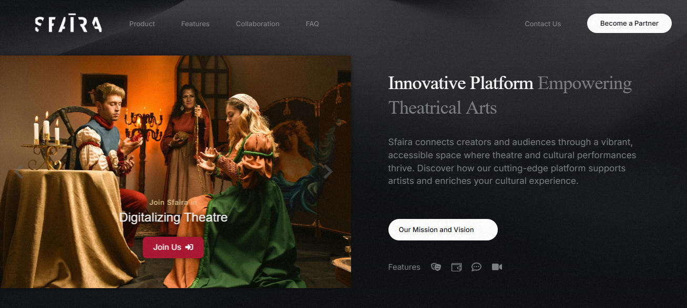
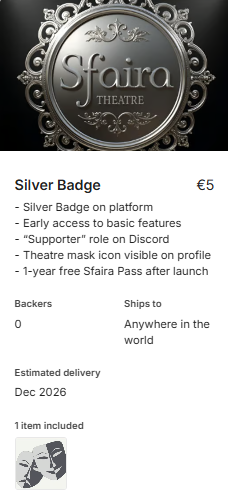
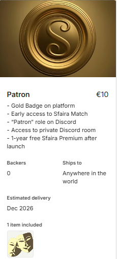
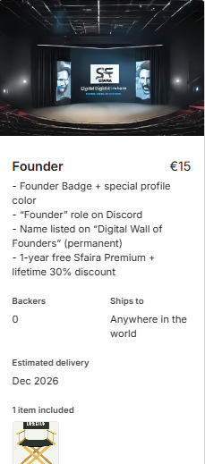
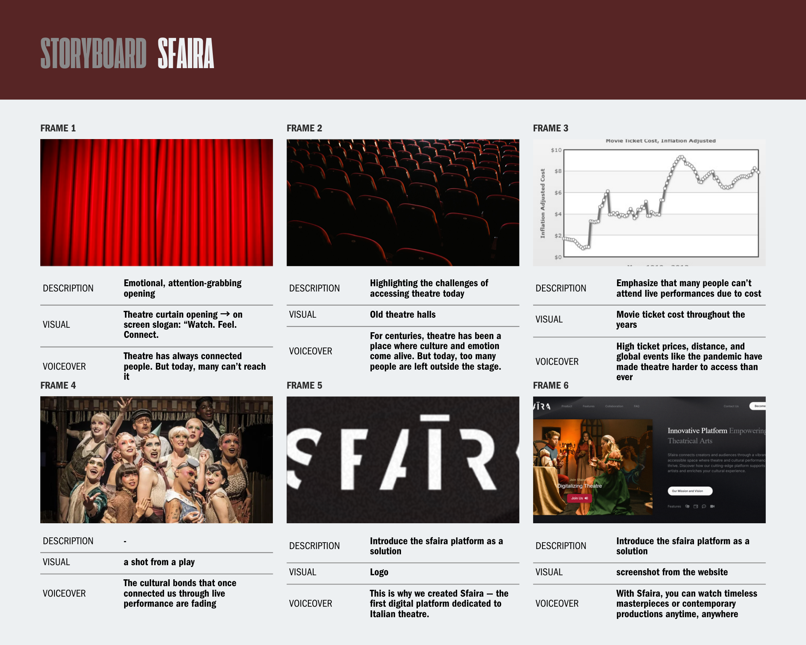
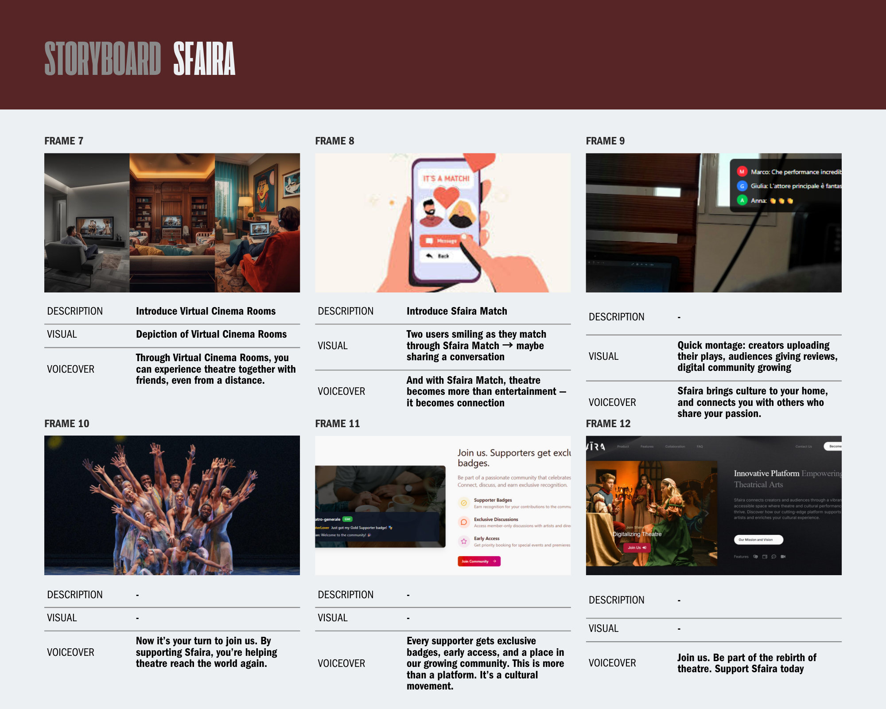
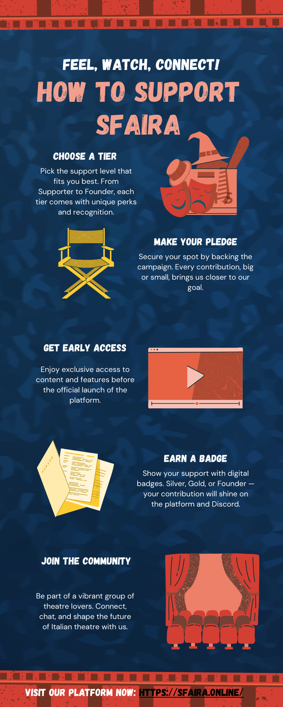
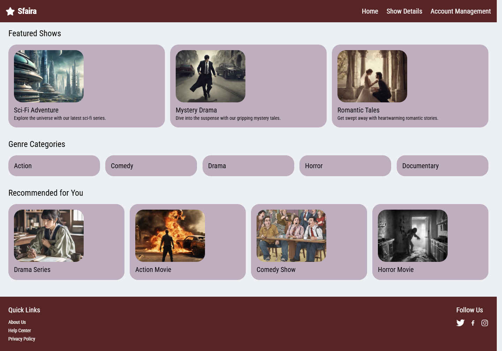
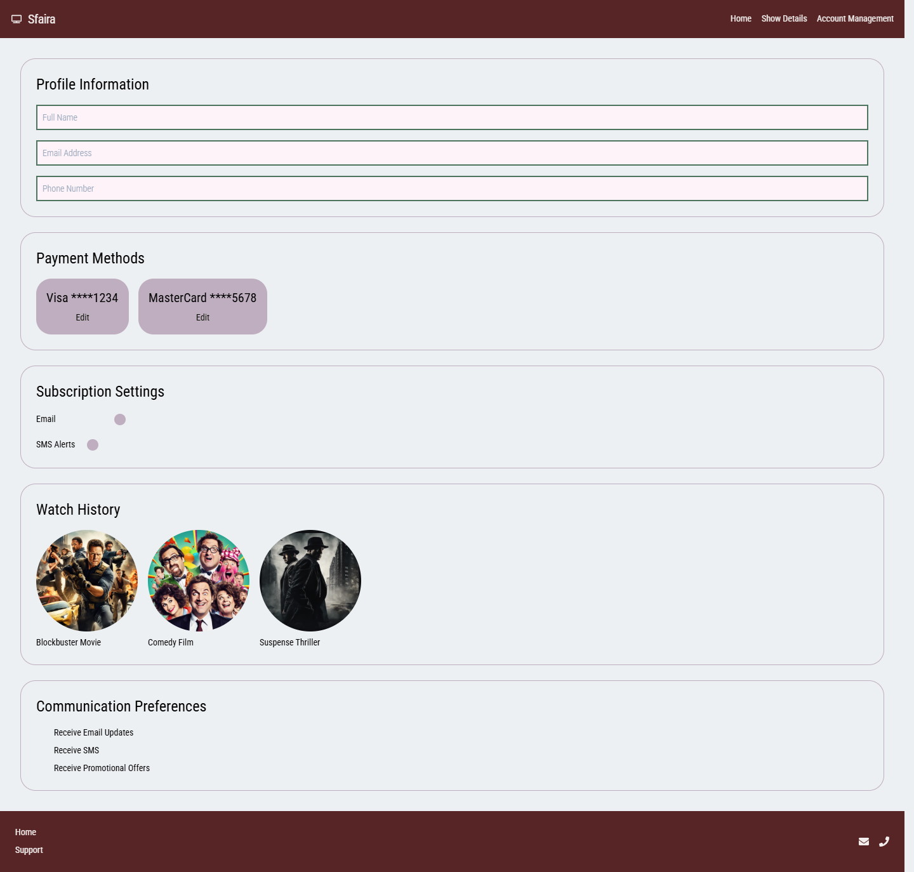
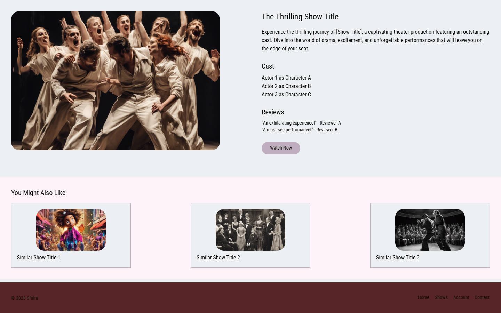

🎭 Sfaira – A Digital Italian Theatre Streaming Platform

📌 Project Overview

Sfaira is a digital theatre platform designed to bring Italian theatre productions to a global audience. The platform combines streaming, virtual cinema rooms, and community features such as reviews, discussions, and Sfaira Match – a social tool for theatre lovers.

This repository contains my work during the Crowdfunding Preparation phase of the project. The focus was on designing and organizing the pre-launch strategy to secure funding and build an early community around Sfaira.

👩‍💻 My Contributions
🔹 Crowdfunding Research

Compared major platforms: Kickstarter, Indiegogo, Seedrs (Republic Europe), Ulule, Eppela, Crowdcube.

Analyzed fees, reach, and suitability for theatre-related projects.

Considered both donation-based and equity-based approaches.

🔹 Campaign Content & Reward Systems

Drafted initial campaign page content based on the business proposal & roadmap.

Designed donation-based tiers (Supporter €4.99, Patron €9.99, Founder €14.99) with badges, Discord roles, and perks.

Reduced subscription model to two tiers for simplicity and affordability:

Sfaira Pass €4.99

Sfaira Premium €9.99

Benchmarked against Marquee TV, Netflix, and similar platforms to remain competitive.

🔹 Storyboard & Visuals

Created a full storyboard for the crowdfunding campaign video 

Designed infographics to explain:

How to support the campaign

How the platform works (user journey)

Produced mockups and milestone tracker designs.

🔹 Outreach & Marketing Preparation

Built an Outreach Database of 30+ contacts: influencers, theatre groups, schools, cultural organizations (Italy + global).

Drafted outreach email templates for both influencers and creators.

Suggested partnerships with independent creators already seeking crowdfunding → hosting their plays on Sfaira at low/no cost.

